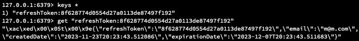

# Anabada : 지역기반 물물교환 플랫폼 

[Kernel360](https://github.com/Kernel360) E2E-Project

## 소개

***동네 주민들과 물건을 바꾸고 나눌 수 있는 지역기반 물물교환 플랫폼.***

| [웹사이트](https://anabada.shop/) | [API 명세](https://anabada.shop/swagger-ui/) | [Wiki Page](https://difficult-file-8f6.notion.site/f837bcc8660f468581bb4423604e5825?v=b7afdb022e06479da8c4497268f78218) |
|----------|----------|---------------|

### 멤버

| Backend                               | Backend                             | Backend                           |
|---------------------------------------|-------------------------------------|-----------------------------------|
| [병룡](https://github.com/fingersdanny) | [윤선](https://github.com/yoonseon12) | [호윤](https://github.com/Uknow928) |

### 목차
- [기술 스택](#기술-스택)
- [서비스 시현 영상](#서비스-시현-영상)
  - [사용자 시현](#사용자-시현)
  - [관리자 시현](#관리자-시현)
- [프로젝트 아키텍쳐](#프로젝트-아키텍쳐)
- [ERD](#erd)
- [기능 명세](#기능-명세)
- [Troubleshooting](#troubleshooting)
  - [클라이언트에서 Ajax를 통한 이미지 파일 업로드](#클라이언트에서-ajax를-통한-이미지-파일-업로드---호윤)
  - [JWT를 이용한 로그인 기능 설계](#jwt를-이용한-로그인-기능-설계---윤선)
  - [Spring Security OAuth 2.0 Client를 통한 소셜 로그인](#spring-security-oauth-20-client를-통한-소셜-로그인---병룡)
  
## 기술 스택
```
Backend
  - Java 17
  - Spring Boot 2.7
  - Spring Data JPA / QueryDSL
  - Spring Security / JWT / OAuth 2.0 Client
  - Spring Cloud OpenFeign
Frontend
  - HTML / CSS
  - Javascript / Jquery / Chart.js
DB
  - MySQL
Cache
  - Spring Data Redis
```
## 서비스 시현 영상

### 사용자 시현


더 자세한 사용자 시현 영상은 [여기](https://drive.google.com/file/d/1K-GDQlVRFaAT5hEnd3VeVsP2R1WfA-pp/view?usp=drive_link)에서 확인하실 수 있습니다.

### 관리자 시현


더 자세한 관리자 시현 영상은 [여기](https://drive.google.com/file/d/1Mg998IMTBMaxK4XrXde1HsIe2O8TkESF/view?usp=drive_link)에서 확인하실 수 있습니다.

## 프로젝트 아키텍쳐


## ERD


## 기능 명세
<details>
<summary> 세부 내용</summary>
<div markdown="1">

|구분    |주 기능           |상세 기능             |설명                  |가능 여부|비고                                                      |속성                                                                              |
|------|---------------|------------------|--------------------|-----|--------------------------------------------------------|--------------------------------------------------------------------------------|
|1.회원  |1.1. 회원가입      |1.1.1. 기본 회원 가입   |                    |     |이메일, 비밀번호, 닉네임, 생년월일, 휴대번호, 성별, 위치기반동의를 입력하여 회원가입할 수 있다.|                                                                                |
|      |               |1.1.2. 소셜 회원 가입   |                    |     |카카오를 통한 소셜 회원가입할 수 있다.                                  |                                                                                |
|      |1.2. 로그인       |1.2.1. 기본 로그인     |                    |     |이메일, 비밀번호를 통해 로그인할 수 있다.                                |                                                                                |
|      |               |1.2.2. 소셜 로그인     |                    |     |카카오를 통한 소셜 로그인을 할 수 있다.                                 |                                                                                |
|      |1.3. 마이페이지     |1.3.1. 개인 정보 수정   |                    |     |이메일, 닉네임은 조회만/ 비밀번호, 휴대번호, 생년원일 변경 가능/ 회원 탈퇴            |                                                                                |
|      |               |1.3.2. 내가 올린 교환 조회|내가 올린 교환 게시글 목록 조회  |     |사용자가 올린 교환 글 목록을 조회한다.                                  |                                                                                |
|      |               |1.3.3. 내가 요청한 내역  |내가 요청한 교환 요청 목록 조회  |     |사용자가 올린 교환 요청 글 목록을 조회한다.                               |                                                                                | 
|      |1.4. 교환 게시판 조회 |1.4.1. 교환 게시판 조회  |                    |     |[바꿔요], [드려요], [요청주세요]의 모든 교환 목록을 조회한다.                  |                                                                                |
|      |               |1.4.2. 교환 게시판 상세조회|1.4.2.1. 교환 게시판 상세조회|     |교환 상품 상세 정보를 확인할 수 있다.                                  |이미 교환을 요청한 사용자는 [요청완료], 교환요청을 최초로 하는 사용자는 [교환 요청],  교환 등록한 사용자는 [요청 조회] 버튼이 보인다.|
|      |               |                  |1.4.2.1. 교환 요청      |     |교환을 요청한다.                                               |교환요청을 최초로 하는 사용자만 [교환 요청] 버튼이 보이며 교환요청 할 수 있다.                                  |
|      |               |                  |1.4.2.2. 요청 조회      |     |                                                        |교환 등록한 사용자만 [요청 조회] 버튼이 보이며 요청을 조회할 수 있다.수락 버튼을 통해 요청 수락 가능                     |
|      |               |                  |1.4.2.3 댓글 추가       |     |교환 요청이 수락된 사용자와 교환 글을 올린 사용자가 댓글을 작성할 수 있다.             |댓글로 연락                                                                          |
|      |1.5. 교환 등록     |1.5.1. 교환 글 추가    |                    |     |[바꿔요],[드려요],[요청주세요] 구분하여 교환 글 추가                        |사용자가 교환 상품 입력 시 제목 자동으로 변경                                                      |
|      |1.6. FAQ       |1.6.1. FAQ 조회     |                    |     |FAQ 게시글을 조회한다.                                          |                                                                                |                                                                                 |
|2. 관리자|2.1. FAQ       |2.3.1. FAQ 추가     |                    |     |FAQ 게시글을 추가한다.                                          |                                                                                |
|      |               |2.3.2. FAQ 삭제     |                    |     |FAQ 게시글을 삭제한다.                                          |                                                                                |
|      |               |2.3.3. FAQ 조회     |                    |     |FAQ 게시글을 조회한다.                                          |                                                                                |
|      |               |2.3.2. FAQ 수정     |                    |     |FAQ 게시글을 수정한다.                                          |                                                                                |
|      |2.2. Admin page|2.2.1. 통계         |연령대                 |     |연령대별 사용 통계를 보여준다.                                       |                                                                                |
|      |               |                  |성별                  |     |성별 사용 통계를 보여준다.                                         |                                                                                |
|      |               |                  |지역                  |     |지역별 사용 통계를 보여준다.                                        |                                                                                |
|      |               |2.2.2. 카테고리       |카테고리 추가             |     |카테고리를 추가한다.                                             |                                                                                |
|      |               |                  |카테고리 삭제             |     |카테고리를 삭제한다.                                             |                                                                                |
|      |               |                  |카테고리 조회             |     |카테고리를 조회한다.                                             |                                                                                |
|      |               |                  |카테고리 수정             |     |카테고리를 수정한다.                                             |                                                                                |
|      |               |2.1.3. 회원 정보 조회   |모든 회원 정보 조회         |     |관리자를 포함한 모든 회원 정보를 조회한다.                                |                                                                                |
|      |               |                  |관리자 추가              |     |관리자 계정을 추가한다.                                           |                                                                                |
|      |               |                  |관리자 삭제              |     |관리자 계정을 선택하여 삭제한다.                                      |                                                                                |
|      |2.3. 교환 조회     |2.3.1.  교환 게시판 조회 |                    |     |[바꿔요], [드려요], [요청주세요]의 모든 교환 목록을 조회한다.                  |                                                                                |
|      |               |1.4.2. 교환 게시판 상세조회|1.4.2.1. 교환 게시판 상세조회|     |교환 상품 상세 정보를 확인할 수 있다.                                  |이미 교환을 요청한 사용자는 [요청완료], 교환요청을 최초로 하는 사용자는 [교환 요청],  교환 등록한 사용자는 [요청 조회] 버튼이 보인다.|
</div>
</details>

## Troubleshooting
> 프로젝트를 기획하고 직접 설계하면서 팀원들이 느꼈던 기술적인 고민들과 프로젝트를 개발하면서 느꼈던 점을 정리하였습니다.
---
### 클라이언트에서 Ajax를 통한 이미지 파일 업로드 - [호윤](https://github.com/Uknow928)

&emsp;프로젝트를 진행하면서 여러 중요한 기능들을 다루었지만, 클라이언트에서 Ajax를 통해 데이터를 전송하고 컨트롤러에서 이를 받아 처리하는 부분에서 이해도가 낮아 어려움을 겪었기에 이에 대한 내용을 트러블슈팅으로 정리하고자 합니다.

&emsp;Post 요청 시 보내는 데이터 타입이 `application/json`인 경우에는 컨트롤러에서 `@RequestBody` 나 `@ModelAttribute` 를 이용하여 데이터를 받을 수 있습니다. 하지만 저희 프로젝트의 교환 등록 부분의 경우 폼 데이터로 이미지파일을 함께 업로드하기에 content 데이터 타입이 `multipart/form-data` 입니다.

&emsp;처음에 데이터를 받아주기 위해 사용하였던 @RequestBody는 클라이언트가 전송하는 `application/json` 형태의 HTTP Body 내용을 자바 객체로 변환시켜주는 역할을 하기 때문에 기본적으로 디폴트 contentType이 `application/json`이 아니라 `application/x-www-form-urlencoded`인 FormData로 전송하게 될 경우 에러가 발생하며, 저희 프로젝트의 경우에는 이미지 파일 전송을 위해 `multipart/form-data` 타입으로 전송하기에 역시 이와 같은 오류가 발생하였습니다.

```java
@PostMapping(path = "/v1/trades")
public ResponseEntity<Long> create(
@ModelAttribute CreateTradeRequest createTradeRequest,
@RequestBody PlaceDto placeDto,
@RequestParam(value = "imageFile", required = false) MultipartFile imageFile)
```

```java
o.s.w.s.m.s.DefaultHandlerExceptionResolver - Resolved [org.springframework.web.HttpMediaTypeNotSupportedException: Content type 'multipart/form-data;boundary=----WebKitFormBoundary8xIfw7pAkRCgXD6k;charset=UTF-8' not supported]
```

&emsp;`@ModelAttribute`는 `@RequestParam`과 같이 폼데이터를 받는데 쓰이며, `@RequestParam`과 다르게 여러 개의 파라미터 값을 객체에 바인딩할 수 있는 어노테이션이지만 JSON 문자열 변수 하나를 받아서 객체에 바인딩하는 역할은 수행할 수 없기에 이와 같이 사용하였을 때 `PlaceDto`에 필드들이 적절하게 바인딩되지 않았습니다.

```java
@PostMapping(path = "/v1/trades")
public ResponseEntity<Long> create(
@ModelAttribute CreateTradeRequest createTradeRequest,
@ModelAttribute PlaceDto placeDto,
@RequestParam(value = "imageFile", required = false) MultipartFile imageFile)
```

&emsp;문제를 해결한 코드는 다음과 같습니다.

```java
@PostMapping(path = "/v1/trades")
public ResponseEntity<Long> create(
    @ModelAttribute CreateTradeRequest createTradeRequest,
    @RequestParam("placeDto") String placeDtoJson,
    @RequestParam(value = "imageFile", required = false) MultipartFile imageFile) {
    if (imageFile != null && !imageFile.isEmpty()) {
       String imagePath = fileHandler.parseFileInfo(imageFile,"trade");
       createTradeRequest.setImagePath(imagePath);
    }
    try {
       PlaceDto placeDto = objectMapper.readValue(placeDtoJson, PlaceDto.class);
       Long savedTradeId = tradeService.create(createTradeRequest, placeDto);
       URI uri = URI.create("/api/v1/trades/"+savedTradeId);

       return ResponseEntity.created(uri).build();
    } catch (JsonProcessingException e) {
       throw new BusinessException(TradeErrorCode.NOT_FOUND_PLACE);
    }

}
```

&emsp;위 코드에서는 `@RequestParam`을 이용하여 JSON 문자열을 받아오고 이를 `objectMapper`을 사용하여 `PlaceDto` 객체로 변환시키는 방식을 사용하여 데이터를 알맞게 맵핑할 수 있었습니다.

---
### JWT를 이용한 로그인 기능 설계 - [윤선](https://github.com/yoonseon12)
&emsp;로그인 기능을 설계하면서, 서버에서 유저의 상태 정보를 보존하고 있는 세션 기반 로그인 방식과 클라이언트에서 최소한의 유저 정보를 가지고 있는 JWT 기반의 무상태 방식 중 어떠한 방식을 선택할지가 중요한 부분이었고 팀원들과 의견 조율을 통해 최종적으로 **서비스의 확장성을 최대한 고려하고 Scale-Out 했을 때 영향이 적은 JWT를 로그인 기능에 적용**하기로 결정했습니다.

&emsp;JWT를 도입하고 설계에 가장 고민이 많았던 부분은 Refresh Token을 어떠한 형식으로, 어디에 저장할 지 결정하는 것 이었습니다.

&emsp;Refresh Token 정보에 만료기간을 포함하여 Access Token과 동일한 형식(헤더+페이로드+시그니처)으로 생성 후 클라이언트에서 Refresh Token을 관리하게 한다면 서버는 사용자의 어떠한 상태정보도 보존하고 있지 않기 때문에 서버에서 사용자의 로그인 정보를 관리할 수 없었습니다.
따라서 **무상태로 설계하되, 서버에서 사용자의 인증정보를 최소한으로 저장하여 제어할 수 있는 방법을 고안**하였습니다.

&emsp;이를 위해서  Access Token과 동일한 형식으로 만드는 것이 아니라 Refresh Token을 **UUID로 중복이 없는 유일한 값으로 생성**하고, 서버에서는 이 **UUID를 Key로 사용하여 사용자의 이메일과 만료일자를 Value로 저장**하였습니다. 이를 통해 서버에서 사용자를 강제로 로그아웃을 시켜야 할 경우, **서버에서 만료 기간을 초기화시켜 클라이언트를 효과적으로 제어**할 수 있습니다.

&emsp;두 번째로 Refresh Token을 어디에 저장해야할지 고민하였는데, 일시적이며 빈번하게 갱신되는 로그인 인증 정보, 특히 Refresh Token과 같은 데이터를 데이터베이스에 저장하는 것은 비효율적이라고 생각되었습니다. 따라서 **빠르고 메모리 기반의 저장소로써 캐시에 직렬화된 객체를 저장하고 조회하는 데 효율적인 Redis를 사용**하였으며 **객체를 직렬화하여 저장**하였습니다.



아래는 이 과정을 통해서 구현한 로그인 프로세스입니다.


---

### Spring Security OAuth 2.0 Client를 통한 소셜 로그인 - [병룡](https://github.com/fingersdanny)
&emsp;아나바다는 기존의 존재하는 회원가입을 통해서 웹 사이트에서 직접 로그인하여 서비스를 이용할 수 있도록 설계하였습니다. 
여기에 사용자 편의성을 부여하고자 카카오를 통한 소셜 로그인 기능을 도입했습니다. [카카오 로그인 API](https://developers.kakao.com/docs/latest/ko/kakaologin/common)는 
OAuth 2.0 표준규격을 따르고 있어서 Spring Security OAuth2 Client를 이용하여 구현할 수 있고 현재 타겟 사용자 층이 국내 사용자인것을 감안하여 도입하였습니다. 
또한 기존 설계에서 [Geolocation API](https://developer.mozilla.org/en-US/docs/Web/API/Geolocation_API)를 통해
가져온 회원 접속 위치의 경도와 위도를 행정구역(법정동)을 [카카오 지도 API](https://developers.kakao.com/docs/latest/ko/local/dev-guide#coord-to-district)를 통해서 
변환하여 가져오기 때문에 동일한 REST API key를 사용하여 소셜 로그인을 구현할 수 있다는 이점이 있었습니다. 

&emsp;OAuth 2.0 Client에서 [공식적으로 지원하는 로그인 플랫폼](https://docs.spring.io/spring-security/reference/reactive/oauth2/login/core.html#webflux-oauth2-login-common-oauth2-provider)은 Google, Github, Okta, Meta(Facebook)가 있고 
카카오와 같은 직접 지원하지 않는 Provider와 같은 경우 
다음과 같이 application 설정에 Provider에 대한 구체적인 명시를 통해서 소셜 계정 정보를 받아올 수 있습니다.

```yaml
spring:
  security:
    oauth2:
      client:
        registration:
          kakao:
            client-id: ${your_client_id}
            client-secret: ${your_client_secret}
            scope:
              - account_email
              - gender
              - birthday
              - profile_nickname
            client-authentication-method: POST
            client-name: Kakao
            authorization-grant-type: authorization_code
            redirect-uri: https://anabada.shop/login/oauth2/code/kakao

        provider:
          kakao:
            authorization-uri: https://kauth.kakao.com/oauth/authorize
            token-uri: https://kauth.kakao.com/oauth/token
            user-info-uri: https://kapi.kakao.com/v2/user/me
            user-name-attribute: kakao_account
```
&emsp;이후 필요한 유저 정보를 받아와서 해당 이메일이 서버의 기존 데이터베이스에 소셜 회원으로 존재하면 로그인시키고, 
기본 회원으로 존재한다면 기본 이메일이 있다는 알림을 표시해 기존 회원으로 로그인하도록 유도합니다. 
만약에 해당하는 이메일로 가입된 계정이 없다면 회원 객체를 생성해 가입시킵니다. 

```java
Member member = memberRepository
			.findByEmail(attributes
			.getOAuth2MemberInfo()
			.getEmail())
			.orElse(null);

		if (member == null) {
			return saveMember(attributes, socialProvider);
		} else if (member.getSocialProvider() == SocialProvider.LOCAL) {
			throw new OAuth2AuthenticationException("이미 회원가입된 이메일입니다.");
		} else {
			return member;
		}
```

&emsp;문제는 회원이 소셜 로그인 계정의 이메일과 기본 회원 계정의 이메일을 동일하게 사용하고 있다면 해당 소셜 계정으로는 로그인할 수 없습니다. 
또한, 현재는 프로젝트에서 카카오 로그인 밖에 구현하고 있지 않지만 이후에 다양한 소셜 로그인 기능을 포함할 수 있도록 고려하여 설계 하였습니다. 
사용자는 해당 이메일을 다른 소셜 계정에도 사용 중일 수 있기 때문에 이 문제는 발생할 수 있습니다. 

&emsp;위 사항을 고려하여, 소셜 계정 연동 테이블을 두어 기존 계정과 연동하는 방식으로 수정하려고 합니다. 소셜 계정 연동 테이블이 따로 존재한다면 
더욱 다양한 소셜 로그인을 제공하려고 할때 프로젝트 구조가 확장성에 열려있으며, 사용자에게도 이메일이 사용 중이라서 소셜 로그인을 하지 못하는 문제를 미리 방지할 수 있습니다.
위와 같이 프로젝트를 설계하면서 왜 많은 상용중인 서비스에서 소셜 계정을 연동하는 방식으로 소셜 로그인을 제공하는지 더욱 잘 이해할 수 있게 되었습니다.
